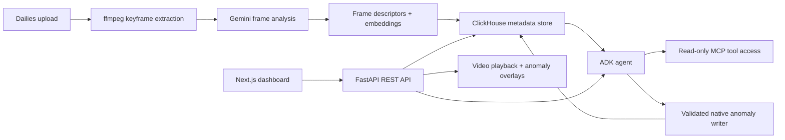

# Continuity.Agent

<p align="center">
  
  
  
  
  
  
</p>

<p align="center">
  <strong>AI-powered visual continuity QA for modern film and television post-production.</strong>
</p>

Continuity.Agent helps editors, post supervisors, and studio teams catch visual inconsistencies across takes before they become expensive reshoots. The system ingests dailies, extracts frame-level descriptors with Gemini vision, indexes them in ClickHouse, and uses an agentic workflow to flag continuity anomalies with explainable reasoning and traceable evidence.

## Why this matters

Production teams lose time and money when subtle continuity errors slip through:

- wardrobe mismatch between takes
- prop placement drift or object disappearance
- lighting and environment inconsistency
- performance continuity issues across a sequence

Continuity.Agent turns that process into a repeatable, AI-assisted review pipeline instead of a manual frame-by-frame audit.

## Highlights

- AI frame analysis with Gemini multimodal models
- ClickHouse-powered indexing and similarity search
- Agentic anomaly detection with structured tool use
- JWT-authenticated API and role-based access control
- Video upload, playback, and timeline anomaly visualization
- Observability with structured logs, tracing, and Prometheus metrics
- Docker-ready local development setup

## System architecture



## Tech stack

| Layer | Technology |
|---|---|
| Backend | Python 3.12, FastAPI |
| Frontend | Next.js 16, TypeScript, Tailwind |
| Database | ClickHouse |
| Video intelligence | Gemini multimodal analysis + embeddings |
| Agent orchestration | Google ADK |
| Storage | Local disk or GCS |
| Deployment | Docker Compose, Cloud-ready service design |

## Core workflow

1. Upload a scene's dailies.
2. Extract keyframes and generate continuity descriptors.
3. Store metadata and embeddings in ClickHouse.
4. Run the continuity agent on scene/take pairs.
5. Inspect anomalies in the dashboard with traceable evidence and flagged timeline markers.

## Quick start

### Option 1: Docker Compose

```bash
cp backend/.env.example backend/.env
# fill in GEMINI_API_KEY and JWT_SECRET_KEY

docker compose up --build
```

This starts:

- backend API on port 8080
- frontend on port 3000
- local ClickHouse instance

### Option 2: Local development without Docker

```bash
cd backend
python3 -m venv .venv
source .venv/bin/activate
pip install -r requirements.txt
pip install uv
cp .env.example .env
# fill in CLICKHOUSE_*, GEMINI_API_KEY, and JWT_SECRET_KEY
uvicorn app.main:app --reload --port 8080
```

```bash
cd frontend
npm install
cp .env.local.example .env.local
npm run dev
```

## Required environment variables

You will need to provide the services below before the app can run end-to-end:

| Variable / dependency | Purpose |
|---|---|
| ClickHouse instance | Primary persistence layer |
| GEMINI_API_KEY | Frame analysis and AI reasoning |
| JWT_SECRET_KEY | Signing tokens |
| ffmpeg | Keyframe extraction |
| uv | Launching the isolated MCP server |
| GCS bucket (optional) | Cloud video storage backend |

## Authentication

The app uses JWT-based auth with role-aware access:

- viewer: read-only
- editor: upload, review, run analysis
- supervisor: full control, including account administration

The first account created on a fresh database becomes the initial supervisor.

```bash
curl -X POST http://localhost:8080/api/auth/register \
  -H "Content-Type: application/json" \
  -d '{"email": "you@studio.com", "password": "a-real-password"}'

curl -X POST http://localhost:8080/api/auth/login \
  -H "Content-Type: application/json" \
  -d '{"email": "you@studio.com", "password": "a-real-password"}'
```

## Observability and production readiness

The platform is built with real operational concerns in mind:

- structured logging with request IDs
- OpenTelemetry tracing
- Prometheus metrics via /metrics
- readiness and liveness health endpoints
- JWT auth with role checks
- pluggable storage backend abstraction

## Running tests

```bash
cd backend
pip install -r requirements-dev.txt
pytest -v
```

This project includes a real pytest suite covering the backend behavior, including ingestion, auth, storage, and agent integration concerns.

## Project structure

```text
.
├── backend/
│   ├── app/
│   │   ├── agents/
│   │   ├── auth/
│   │   ├── db/
│   │   ├── observability/
│   │   ├── routers/
│   │   ├── services/
│   │   └── models/
│   ├── tests/
│   ├── Dockerfile
│   ├── requirements.txt
│   └── README.md
├── frontend/
│   ├── app/
│   ├── components/
│   ├── lib/
│   └── package.json
├── docker-compose.yml
├── README.md
└── .env.example (if present in your setup)
```

## Why this project is different

This is not a toy demo. It is a working system designed around real media-operation constraints:

- actual video ingestion pipeline
- persistent indexing and retrieval in ClickHouse
- multimodal AI analysis rather than static rule checks
- agent-based reasoning with schema-validated writes
- production-facing logging, metrics, and auth patterns

## Roadmap

- stronger review workflows and resolve actions
- richer anomaly scoring and confidence thresholds
- team-based workspace management
- deployment automation for cloud hosting
- additional visual QA checks beyond continuity detection

## License

This project is currently distributed as a private/internal build. Add your preferred license before open-sourcing or external distribution.

## Acknowledgements

Built for high-velocity post-production teams that need AI-assisted quality control without sacrificing traceability and accountability.

---

If you want, I can also turn this into a more cinematic GitHub-style README with a hero banner, screenshot placeholders, and a more premium "studio product" brand voice.
